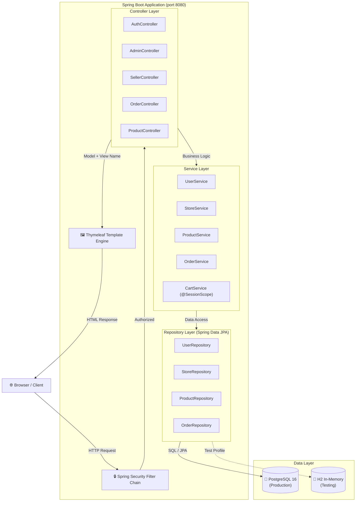
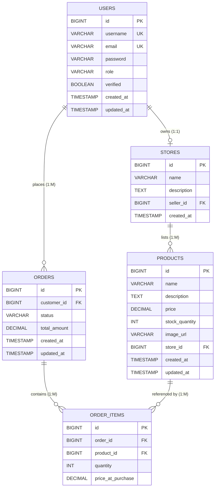
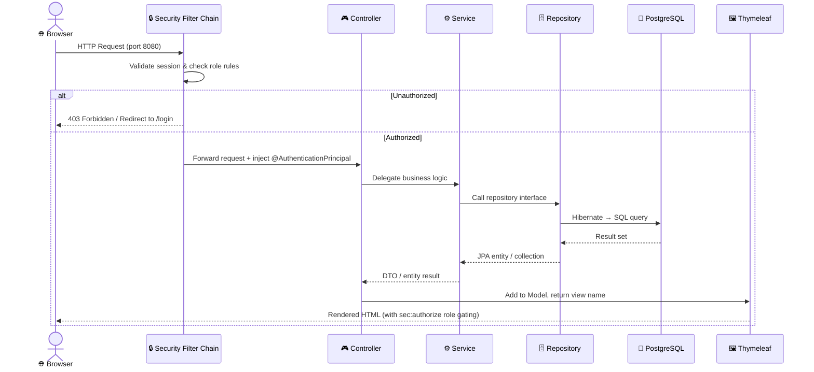
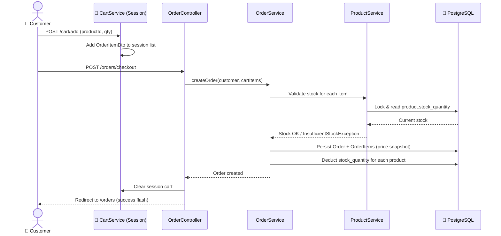
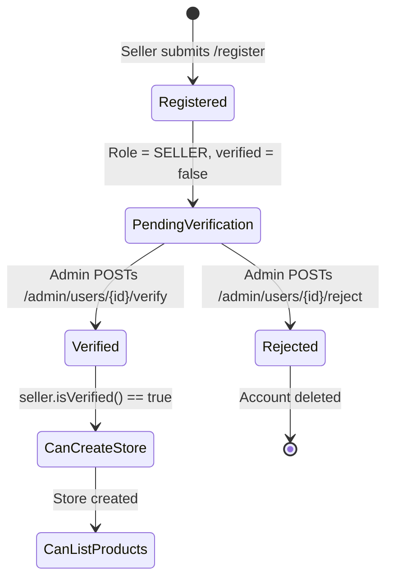
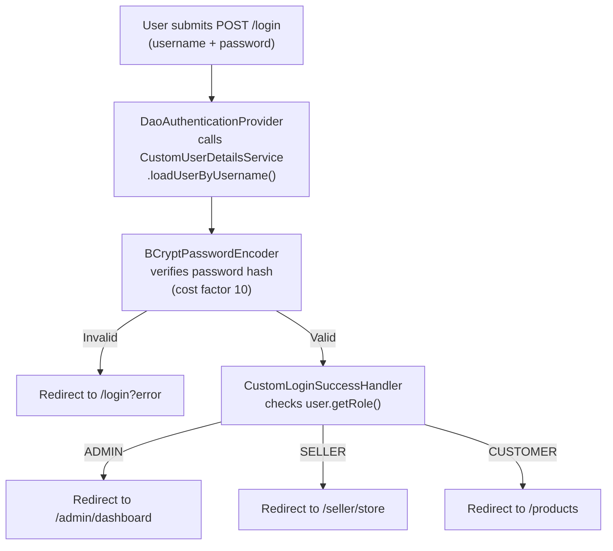
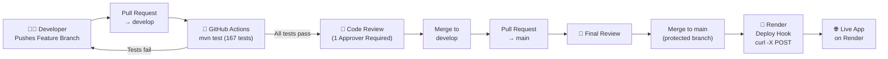
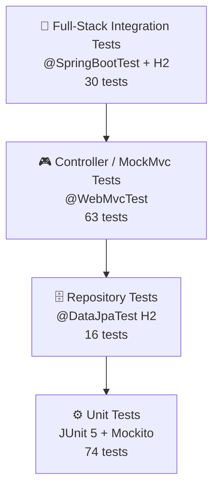

# 🛍️ MiNu Store — Mini Marketplace Platform

> A role-based, full-stack e-commerce marketplace built with Spring Boot 3.2, PostgreSQL 16, Docker, and GitHub Actions CI/CD.

[](https://github.com)
[](https://spring.io/projects/spring-boot)
[](https://openjdk.org/)
[](https://www.docker.com/)
[](https://www.postgresql.org/)
[](LICENSE)

---

## 📑 Table of Contents

1. [Project Description](#1-project-description)
2. [Architecture Overview](#2-architecture-overview)
3. [Database Design](#3-database-design)
4. [System Workflow](#4-system-workflow)
5. [Core Features](#5-core-features)
6. [Tech Stack](#6-tech-stack)
7. [Authentication & Authorization](#7-authentication--authorization)
8. [API Endpoints](#8-api-endpoints)
9. [Run Instructions](#9-run-instructions)
10. [CI/CD Pipeline](#10-cicd-pipeline)
11. [Design Patterns](#11-design-patterns)
12. [Testing](#12-testing)
13. [Troubleshooting](#13-troubleshooting)
14. [Team](#14-team)

---

## 1. Project Description

**MiNu Store** is a production-grade, full-stack mini marketplace web application developed as a Software Engineering Lab project at **Khulna University of Engineering & Technology (KUET)**, Department of Computer Science and Engineering.

The platform connects three distinct actors — **Customers**, **Sellers**, and **Administrators** — through a secure role-based access control (RBAC) system. It demonstrates a complete professional software development lifecycle: clean layered architecture, Spring Security, comprehensive multi-layer testing, Docker containerisation, and automated GitHub Actions CI/CD with deployment on Render.

### Design Philosophy

- **Separation of Concerns** — strict five-layer architecture (Presentation → Controller → Service → Repository → Data)
- **Security First** — role enforcement at both the URL filter level and the service method level
- **Test-Driven Quality** — 167 automated tests spanning unit, controller, repository, and full-stack integration layers
- **Infrastructure as Code** — Docker Compose and GitHub Actions define the entire runtime and delivery pipeline declaratively

---

## 2. Architecture Overview

### Layered Architecture

```
┌──────────────────────────────────────────────────────────┐
│            Presentation Layer                            │
│         Thymeleaf Templates + CSS/JS                     │
├──────────────────────────────────────────────────────────┤
│             Controller Layer                             │
│  AuthController · AdminController · SellerController     │
│  OrderController · ProductController · HomeController    │
├──────────────────────────────────────────────────────────┤
│              Service Layer                               │
│  UserService · StoreService · ProductService             │
│  OrderService · CartService · CustomUserDetailsService   │
├──────────────────────────────────────────────────────────┤
│            Repository Layer                              │
│  UserRepo · StoreRepo · ProductRepo · OrderRepo          │
├──────────────────────────────────────────────────────────┤
│               Data Layer                                 │
│        PostgreSQL 16 (prod) · H2 In-Memory (test)        │
└──────────────────────────────────────────────────────────┘
```

### Architecture Diagram



### Package Structure

```
src/main/java/com/minuStore/MiNu/
├── config/
│   ├── SecurityConfig.java              # URL rules, BCrypt bean
│   ├── CustomLoginSuccessHandler.java   # Role-based redirect on login
│   ├── DataInitializer.java             # Seeds default users on startup
│   └── GlobalControllerAdvice.java      # Injects cartCount into all views
├── controller/
│   ├── AuthController.java              # /login, /register
│   ├── HomeController.java              # /
│   ├── AdminController.java             # /admin/**
│   ├── SellerController.java            # /seller/**
│   ├── OrderController.java             # /cart/**, /orders/**
│   └── ProductController.java           # /products/**
├── service/
│   ├── UserService.java
│   ├── StoreService.java
│   ├── ProductService.java
│   ├── OrderService.java
│   ├── CartService.java                 # @SessionScope
│   └── CustomUserDetailsService.java
├── model/
│   ├── User.java    Store.java    Product.java
│   ├── Order.java   OrderItem.java
│   └── Role.java    OrderStatus.java
├── repository/
│   ├── UserRepository.java     StoreRepository.java
│   ├── ProductRepository.java  OrderRepository.java
│   └── OrderItemRepository.java
├── dto/
│   ├── UserRegistrationDto.java   ProductDto.java
│   ├── StoreDto.java              OrderDto.java
│   └── OrderItemDto.java
└── MiNuApplication.java
```

---

## 3. Database Design

### Entity-Relationship Diagram



### Table Descriptions

| Table | Purpose | Key Constraints |
|---|---|---|
| `users` | Platform accounts (Admin / Seller / Customer) | `username` UNIQUE, `email` UNIQUE |
| `stores` | Seller storefronts | `seller_id` UNIQUE (one store per seller) |
| `products` | Items listed for sale | `price` DECIMAL(10,2), `stock_quantity` NOT NULL |
| `orders` | Customer purchase orders | Status enum: PENDING → PAID → CONFIRMED → SHIPPED → DELIVERED / CANCELLED |
| `order_items` | Line items within an order | `price_at_purchase` — immutable price snapshot |

### Key Design Decisions

| Decision | Rationale |
|---|---|
| `price_at_purchase` in `order_items` | Freezes price at order time; future product price changes never alter historical records |
| `verified` flag on `users` | Prevents sellers from listing products until an admin approves the account |
| `FetchType.EAGER` on `Order.orderItems` and `Store.products` | Prevents `LazyInitializationException` in Thymeleaf views rendered outside a Hibernate transaction |
| `@EqualsAndHashCode(of="id")` on all entities | Prevents Lombok-generated `StackOverflowError` in bidirectional JPA relationships |

---

## 4. System Workflow

### Authenticated Request Lifecycle



### Order Flow



### Admin Seller Verification Flow



---

## 5. Core Features

### Feature List

**Admin**
- Dashboard with platform-wide statistics (users, pending verifications, stores, orders)
- User management: verify, reject, or delete seller accounts
- Full product oversight with deletion capability
- Order management with inline status updates
- Store registry view

**Seller** *(requires admin verification)*
- Store creation and inline editing
- Product CRUD with stock management
- Stock level visual indicators (green ≥ 6 · amber 1–5 · red = 0)
- Shared product form for create and edit operations

**Customer**
- Product browsing grid with live search
- Product detail page with stock-bounded quantity selector
- Session-scoped cart with line-item management
- Order history with status badges
- Checkout with automatic stock deduction

**Platform**
- Role-aware navigation via `sec:authorize` Thymeleaf dialect
- Flash message system (auto-dismiss)
- Dark luxury UI with gold accents (Playfair Display + DM Sans)
- Responsive layout (CSS Grid + Flexbox)
- Product image fallback (no JavaScript dependency)

### Role-Permission Matrix

| Action | `ADMIN` | `SELLER` (Verified) | `SELLER` (Unverified) | `CUSTOMER` |
|---|:---:|:---:|:---:|:---:|
| Browse products | ✅ | ✅ | ✅ | ✅ |
| View product detail | ✅ | ✅ | ✅ | ✅ |
| Add to cart | ❌ | ❌ | ❌ | ✅ |
| Checkout / place order | ❌ | ❌ | ❌ | ✅ |
| View own order history | ❌ | ❌ | ❌ | ✅ |
| Create / manage store | ❌ | ✅ | ❌ | ❌ |
| Create / edit products | ❌ | ✅ | ❌ | ❌ |
| Delete own products | ❌ | ✅ | ❌ | ❌ |
| View admin dashboard | ✅ | ❌ | ❌ | ❌ |
| Verify / reject sellers | ✅ | ❌ | ❌ | ❌ |
| Delete any product | ✅ | ❌ | ❌ | ❌ |
| Update any order status | ✅ | ❌ | ❌ | ❌ |

---

## 6. Tech Stack

| Layer | Technology | Version |
|---|---|---|
| Backend Framework | Spring Boot | 3.2.5 |
| Language | Java | 17 |
| Templating | Thymeleaf + Security Dialect | — |
| Security | Spring Security | 6.2.4 |
| Persistence | Spring Data JPA / Hibernate | 3.2.5 |
| Database (Production) | PostgreSQL | 16 |
| Database (Testing) | H2 In-Memory | — |
| Build Tool | Maven | 3.9 |
| Containerisation | Docker + Docker Compose | — |
| CI/CD | GitHub Actions | — |
| Deployment | Render | — |
| Boilerplate Reduction | Lombok | 1.18.32 |
| Unit Testing | JUnit 5 + Mockito | Managed |
| Web Layer Testing | MockMvc + AssertJ | Managed |
| Integration Testing | @SpringBootTest + H2 | Managed |

---

## 7. Authentication & Authorization

### Login Flow



### Step-by-Step Login Process

1. User submits credentials to `POST /login`
2. `DaoAuthenticationProvider` loads the user via `CustomUserDetailsService.loadUserByUsername()`
3. `BCryptPasswordEncoder` verifies the submitted password against the stored BCrypt hash (cost factor 10)
4. On **success** → `CustomLoginSuccessHandler` inspects `user.getRole()` and redirects to the appropriate dashboard
5. On **failure** → Spring Security redirects to `/login?error`

### Security Configuration

```java
http.authorizeHttpRequests(auth -> auth
    .requestMatchers(
        "/", "/register", "/login", "/error",
        "/products", "/products/**",
        "/css/**", "/js/**", "/images/**"
    ).permitAll()
    .requestMatchers("/admin/**").hasRole("ADMIN")
    .requestMatchers("/seller/**").hasRole("SELLER")
    .requestMatchers("/cart/**", "/orders/**").hasRole("CUSTOMER")
    .anyRequest().authenticated()
);
```

### Two-Level Role Enforcement

| Level | Mechanism | Description |
|---|---|---|
| **URL Level** | `SecurityConfig` | Spring Security filter chain blocks requests before they reach any controller |
| **Service Level** | Business method guards | `productService.createProduct()` verifies `seller.isVerified()` and ownership — prevents privilege escalation even if URL filtering is bypassed |
| **View Level** | `sec:authorize` | Thymeleaf conditionally renders navigation and action buttons based on role |

### Password Security

- Passwords are hashed with **BCrypt** at the default cost factor of **10** (2¹⁰ iterations)
- Plaintext passwords are **never stored** at any point
- Test configuration overrides cost factor to **4** for performance without compromising correctness

### Session-Scoped Cart

`CartService` is annotated `@SessionScope`. Each authenticated session maintains its own in-memory `List<OrderItemDto>` as the cart. The cart is cleared after successful checkout. No cart data is persisted to the database.

---

## 8. API Endpoints

### Public Endpoints

| Method | Endpoint | Description | Response |
|---|---|---|---|
| `GET` | `/` | Landing page | `200 OK` — HTML |
| `GET` | `/login` | Login form | `200 OK` — HTML |
| `POST` | `/login` | Process credentials | `302` → dashboard or `/login?error` |
| `GET` | `/register` | Registration form | `200 OK` — HTML |
| `POST` | `/register` | Create user account | `302` → `/login` |
| `GET` | `/products` | Browse / search products | `200 OK` — HTML |
| `GET` | `/products/{id}` | Product detail page | `200 OK` — HTML |

**Example — Registration Request Body (form data)**

```
username=john_doe&email=john@example.com&password=secret123&role=CUSTOMER
```

**Validation Errors**

```
302 → /register?error=username_taken
302 → /register?error=email_taken
```

---

### Customer Endpoints *(Role: CUSTOMER)*

| Method | Endpoint | Description | Response |
|---|---|---|---|
| `POST` | `/cart/add` | Add item to session cart | `302` → `/products/{id}` |
| `GET` | `/cart` | View cart contents | `200 OK` — HTML |
| `POST` | `/cart/remove` | Remove item from cart | `302` → `/cart` |
| `POST` | `/orders/checkout` | Place order from cart | `302` → `/orders` (success) |
| `GET` | `/orders` | View order history | `200 OK` — HTML |

**Example — Add to Cart (form data)**

```
productId=42&quantity=2
```

**Example — Checkout Error Response**

```
302 → /cart?error=insufficient_stock
```

---

### Seller Endpoints *(Role: SELLER, must be verified)*

| Method | Endpoint | Description | Response |
|---|---|---|---|
| `GET` | `/seller/store` | View / create store dashboard | `200 OK` — HTML |
| `POST` | `/seller/store` | Create new store | `302` → `/seller/store` |
| `POST` | `/seller/store/update` | Update store details | `302` → `/seller/store` |
| `GET` | `/seller/products` | List own products | `200 OK` — HTML |
| `GET` | `/seller/products/new` | New product form | `200 OK` — HTML |
| `POST` | `/seller/products` | Create product | `302` → `/seller/products` |
| `GET` | `/seller/products/{id}/edit` | Edit product form | `200 OK` — HTML |
| `POST` | `/seller/products/{id}/edit` | Update product | `302` → `/seller/products` |
| `POST` | `/seller/products/{id}/delete` | Delete own product | `302` → `/seller/products` |

**Example — Create Product (form data)**

```
name=Wireless Headphones&description=Noise cancelling&price=2499.99&stockQuantity=50&imageUrl=https://...
```

---

### Admin Endpoints *(Role: ADMIN)*

| Method | Endpoint | Description | Response |
|---|---|---|---|
| `GET` | `/admin/dashboard` | Platform statistics overview | `200 OK` — HTML |
| `GET` | `/admin/users` | All users table | `200 OK` — HTML |
| `POST` | `/admin/users/{id}/verify` | Verify a seller account | `302` → `/admin/users` |
| `POST` | `/admin/users/{id}/reject` | Reject and delete account | `302` → `/admin/users` |
| `POST` | `/admin/users/{id}/delete` | Delete any user | `302` → `/admin/users` |
| `GET` | `/admin/stores` | All stores overview | `200 OK` — HTML |
| `GET` | `/admin/products` | All products overview | `200 OK` — HTML |
| `POST` | `/admin/products/{id}/delete` | Delete any product | `302` → `/admin/products` |
| `GET` | `/admin/orders` | All orders overview | `200 OK` — HTML |
| `POST` | `/admin/orders/{id}/status` | Update order status | `302` → `/admin/orders` |

**Order Status Values**

```
PENDING → PAID → CONFIRMED → SHIPPED → DELIVERED
                                     ↘ CANCELLED
```

---

## 9. Run Instructions

### Prerequisites

| Tool | Version | Required For |
|---|---|---|
| Docker Desktop / Engine | 4.x / 26.x | Docker-based run |
| Docker Compose Plugin | — | Docker-based run |
| Java JDK | 17 | Local test run only |
| Maven | 3.9+ (or use `./mvnw`) | Local test run only |

---

### Option A — Docker (Recommended)

```bash
# 1. Clone the repository
git clone https://github.com/<team>/minu-store.git
cd minu-store

# 2. Start the full stack (app + PostgreSQL)
docker compose up --build

# 3. Open in browser
# http://localhost:8081
```

**Default Seed Accounts**

| Username | Password | Role | Verified |
|---|---|---|---|
| `admin` | `admin123` | ADMIN | ✅ |
| `seller` | `seller123` | SELLER | ✅ |
| `customer` | `customer123` | CUSTOMER | ✅ |

> These accounts are created automatically by `DataInitializer` on first startup.

---

### Option B — Local Development (No Docker)

```bash
# Requires Java 17 + Maven 3.9+
# Uses H2 in-memory — no database setup needed

./mvnw spring-boot:run
# App starts at http://localhost:8080
```

---

### Option C — Run Tests Only

```bash
# All 167 tests (uses H2 — no Docker required)
./mvnw test

# Specific test class
./mvnw test -Dtest=OrderServiceTest

# Specific test method
./mvnw test -Dtest=OrderServiceTest#createOrder_success

# Unit tests only (service layer)
./mvnw test -Dtest="com.minuStore.MiNu.service.*"

# Integration tests only
./mvnw test -Dtest="com.minuStore.MiNu.integration.*"
```

---

### Environment Variables (Docker)

| Variable | Default | Description |
|---|---|---|
| `SPRING_PROFILES_ACTIVE` | `docker` | Activates Docker Spring profile |
| `SPRING_DATASOURCE_URL` | `jdbc:postgresql://postgres:5432/minu_db` | PostgreSQL JDBC URL |
| `SPRING_DATASOURCE_USERNAME` | `minu_user` | Database username |
| `SPRING_DATASOURCE_PASSWORD` | `minu_secret` | Database password |
| `POSTGRES_DB` | `minu_db` | PostgreSQL database name |
| `POSTGRES_USER` | `minu_user` | PostgreSQL user |
| `POSTGRES_PASSWORD` | `minu_secret` | PostgreSQL password |

> ⚠️ Change all default credentials before any public-facing deployment.

---

### Spring Profile Strategy

| Profile | Active When | Datasource |
|---|---|---|
| *(default)* | Local dev without Docker | H2 in-memory (fallback) |
| `docker` | Docker Compose runtime | PostgreSQL via env variable overrides |
| `test` | `@ActiveProfiles("test")` on test classes | H2 with PostgreSQL compatibility mode |

---

## 10. CI/CD Pipeline

### Pipeline Architecture



### GitHub Actions Workflow

```yaml
name: CI/CD Pipeline
on:
  push:
    branches: [main, develop]
  pull_request:
    branches: [main]

jobs:
  test:
    runs-on: ubuntu-latest
    steps:
      - uses: actions/checkout@v4
      - uses: actions/setup-java@v4
        with:
          java-version: '17'
          distribution: 'temurin'
      - name: Cache Maven dependencies
        uses: actions/cache@v4
        with:
          path: ~/.m2
          key: ${{ runner.os }}-m2-${{ hashFiles('**/pom.xml') }}
      - name: Run all tests
        run: mvn test

  deploy:
    needs: test
    runs-on: ubuntu-latest
    if: github.ref == 'refs/heads/main'
    steps:
      - name: Trigger Render deploy
        run: curl -X POST "${{ secrets.RENDER_DEPLOY_HOOK_URL }}"
```

### Branch Protection Rules

| Rule | Setting |
|---|---|
| Direct push to `main` | ❌ Blocked |
| Merge method | Pull Request only |
| Required reviewers | 1 approval minimum |
| Required status checks | CI (`mvn test`) must pass |
| Feature branch base | `develop` |

### Pipeline Steps Summary

| Step | Trigger | Action |
|---|---|---|
| 1 | Push to feature branch | Developer opens PR → `develop` |
| 2 | PR opened | GitHub Actions runs `mvn test` (H2, no external DB) |
| 3 | Tests pass | Team member reviews and approves PR |
| 4 | Merged to `develop` | Opens second PR → `main` |
| 5 | PR to `main` approved | Merge triggers `deploy` job |
| 6 | Deploy job fires | Curl hits `RENDER_DEPLOY_HOOK_URL` secret |
| 7 | Render responds | Pulls `main`, rebuilds Docker image, restarts service |

---

## 11. Design Patterns

### 1. Layered Architecture (n-Tier)

The application enforces a strict five-layer dependency flow. No layer may skip a level.

```
Controller → Service → Repository → Database
```

Controllers never access repositories directly. Services own all business rules.

---

### 2. Data Transfer Object (DTO) Pattern

Raw JPA entities are never exposed directly in forms or views. DTOs decouple the persistence model from the presentation layer.

```java
// DTO — used in registration form binding
public class UserRegistrationDto {
    private String username;
    private String email;
    private String password;
    private Role role;
}

// Controller — binds form to DTO, not entity
@PostMapping("/register")
public String register(@ModelAttribute UserRegistrationDto dto) {
    userService.registerUser(dto);
    return "redirect:/login";
}
```

---

### 3. Repository Pattern (Spring Data JPA)

All data access is abstracted behind repository interfaces. The application never writes raw SQL (except via JPQL `@Query` annotations when needed).

```java
public interface ProductRepository extends JpaRepository<Product, Long> {
    List<Product> findByStore(Store store);
    List<Product> findByNameContainingIgnoreCase(String keyword);
}
```

---

### 4. Session-Scoped Bean (Cart)

`CartService` is a Spring-managed bean scoped to the HTTP session. Each user gets their own isolated cart instance without any database round-trip.

```java
@Service
@SessionScope
public class CartService {
    private final List<OrderItemDto> cartItems = new ArrayList<>();
    
    public void addItem(OrderItemDto item) { cartItems.add(item); }
    public void clear()                    { cartItems.clear();   }
    public List<OrderItemDto> getItems()   { return cartItems;    }
}
```

---

### 5. Template Method / Role-Based Redirect (Strategy Pattern)

`CustomLoginSuccessHandler` encapsulates the post-login redirect strategy, varying behaviour by role without if-else chains in controllers.

```java
@Override
protected void onAuthenticationSuccess(HttpServletRequest req,
                                       HttpServletResponse res,
                                       Authentication auth) throws IOException {
    User user = (User) auth.getPrincipal();
    String target = switch (user.getRole()) {
        case ADMIN    -> "/admin/dashboard";
        case SELLER   -> "/seller/store";
        case CUSTOMER -> "/products";
    };
    res.sendRedirect(target);
}
```

---

### 6. Price Snapshot (Immutable Value Pattern)

At checkout, `price_at_purchase` is copied from the current `Product.price` into `OrderItem`. This value is **never updated** — it is a historical record, not a foreign-key reference.

```java
OrderItem item = new OrderItem();
item.setProduct(product);
item.setQuantity(dto.getQuantity());
item.setPriceAtPurchase(product.getPrice()); // snapshot — immutable after this
```

---

## 12. Testing

### Testing Strategy



**Total: 167 tests** — exceeding the mandatory minimum of 15 unit tests + 3 integration tests.

### Test Count by Class

| Test Class | Framework | Layer | Tests |
|---|---|---|:---:|
| `CartServiceTest` | JUnit 5 + Mockito | Unit | 10 |
| `OrderServiceTest` | JUnit 5 + Mockito | Unit | 16 |
| `ProductServiceTest` | JUnit 5 + Mockito | Unit | 18 |
| `StoreServiceTest` | JUnit 5 + Mockito | Unit | 13 |
| `UserServiceTest` | JUnit 5 + Mockito | Unit | 17 |
| `AdminControllerTest` | `@WebMvcTest` | Controller | 13 |
| `AuthControllerTest` | `@WebMvcTest` | Controller | 10 |
| `OrderControllerTest` | `@WebMvcTest` | Controller | 11 |
| `ProductControllerTest` | `@WebMvcTest` | Controller | 7 |
| `SellerControllerTest` | `@WebMvcTest` | Controller | 22 |
| `RepositoryIntegrationTest` | `@DataJpaTest` (H2) | Repository | 16 |
| `FullStackIntegrationTest` | `@SpringBootTest` (H2) | Full-Stack | 14 |
| **Total** | | | **167** |

### Unit Test Example

```java
@Test
@DisplayName("should deduct stock after order creation")
void createOrder_deductsStock() {
    int initialStock = product.getStockQuantity(); // 10
    List<OrderItemDto> items = List.of(TestFixtures.orderItemDto(product.getId(), 3));

    when(productRepository.findById(product.getId()))
        .thenReturn(Optional.of(product));
    when(orderRepository.save(any(Order.class)))
        .thenAnswer(inv -> inv.getArgument(0));

    orderService.createOrder(verifiedCustomer, items);

    assertThat(product.getStockQuantity()).isEqualTo(initialStock - 3);
    verify(productRepository).save(product);
}
```

### Controller Test Setup

```java
// ✅ Correct — injects app User entity as principal
mockMvc.perform(get("/seller/products")
    .with(user(sellerUser)))  // SecurityMockMvcRequestPostProcessors.user()
    .andExpect(status().isOk());

// ❌ Wrong for controllers that read @AuthenticationPrincipal
// @WithMockUser injects a String principal — causes NullPointerException
// inside controller methods that cast the principal to User entity
```

### Integration Test Configuration

```properties
# src/test/resources/application-test.properties
spring.datasource.url=jdbc:h2:mem:minu_test_db;DB_CLOSE_DELAY=-1;MODE=PostgreSQL;DATABASE_TO_LOWER=TRUE
spring.datasource.driver-class-name=org.h2.Driver
spring.jpa.database-platform=org.hibernate.dialect.H2Dialect
spring.jpa.hibernate.ddl-auto=create-drop
spring.h2.console.enabled=false
```

### Integration Scenarios Covered

- User registration → password encoding → admin verification → store creation
- Product CRUD cycle with ownership enforcement
- Full order flow: cart → checkout → stock deduction → status progression
- Error cases: unverified seller, insufficient stock, duplicate username/email

---

## 13. Troubleshooting

| Problem | Root Cause | Fix |
|---|---|---|
| `isVerified()` throws `UnsupportedOperationException` | Lombok `@Data` auto-generates boolean getter but a custom override was throwing | Replace with `return this.verified;`; switch from `@Data` to explicit `@Getter`/`@Setter` |
| `cartCount` null in navbar on all pages | Navbar fragment references `cartCount` but only the cart controller set it in the model | Add `GlobalControllerAdvice` with `@ModelAttribute("cartCount")` |
| `LazyInitializationException` in admin stores view | `store.products` was `LAZY`; Thymeleaf rendered outside an active Hibernate session | Change `Store.products` to `FetchType.EAGER` |
| Duplicate `style` attribute parse error (Thymeleaf) | Same element had both `style=""` and `th:style=""`; attoparser is strict XML | Replace all `th:style` with `th:if`/`th:unless`; remove all `onerror` handlers |
| `NullPointerException` in seller controller tests | `@WithMockUser` injects a Spring `String` principal, not the app `User`; `@AuthenticationPrincipal` receives `null` | All controller tests that read the principal now use `.with(user(userObject))` |
| `Unable to determine Dialect` on default test run | `MiNuApplicationTests` had no `@ActiveProfiles`; base `application.properties` had no datasource URL after profile split | Add `@ActiveProfiles("test")` and H2 fallback in base properties |
| Null service injection in `OrderController` | Field initialized as `private final OrderService orderService = null;` | Remove null assignment; use constructor injection via `@RequiredArgsConstructor` |
| `StackOverflowError` in entity `toString()` | Lombok `@Data` on bidirectional JPA entities generates recursive `toString()` | Use `@ToString(exclude={"store"})` and `@EqualsAndHashCode(of="id")` on all entities |
| App starts before PostgreSQL is ready (Docker) | Race condition — app container starts before `postgres` container accepts connections | Add `healthcheck` with `pg_isready` and `depends_on: condition: service_healthy` in Compose |

---

## 14. Team

| Name | Roll Number | Institution |
|---|---|---|
| Al Shariar Hossain | 2107066 | KUET — CSE |
| Hassan Mohammed Naquibul Hoque | 2107077 | KUET — CSE |

**Course:** Software Engineering Lab (CSE-3220)  
**Submission Date:** March 25, 2026  
**Department:** Computer Science and Engineering  
**Institution:** Khulna University of Engineering & Technology

---

<div align="center">

**MiNu Store**  
Spring Boot · PostgreSQL · Docker · GitHub Actions

</div>